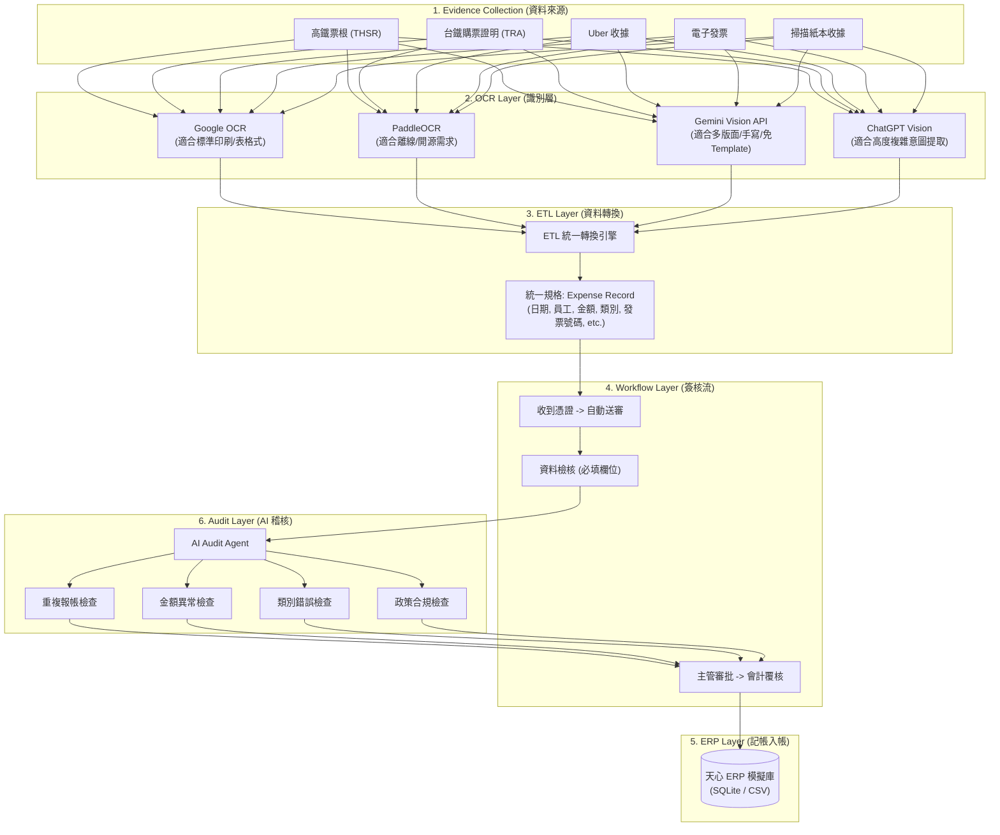
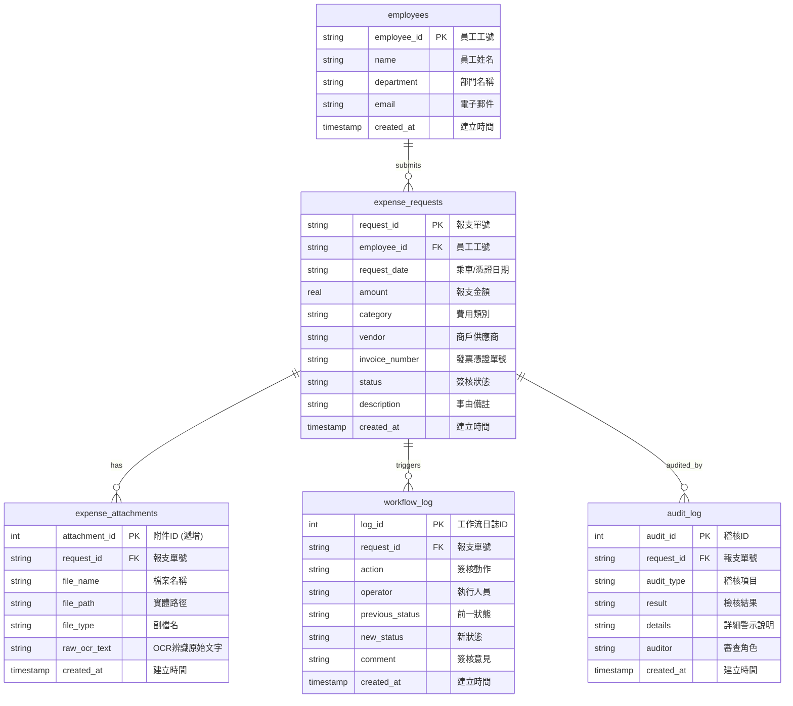
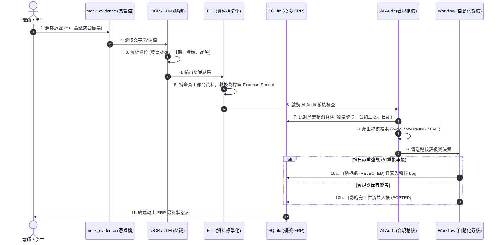

# 天心 ERP Class04 插花專案：AAA-Evidence Hub
> **企業電子憑證自動化處理平台 (Electronic Evidence Collection & Processing Hub)**
> 
> 本專案為天心 ERP AI 內訓課程之核心 PoC (Proof of Concept)，旨在展示如何以**中小企業 (SME)** 與**一人資訊部門 (OPC)** 視角，利用 AI 結合 **FALO ETL、FALO OCR、FALO Workflow 與 FALO Audit** 產品線，實現「憑證收集 → 辨識 → 轉換 → 簽核 → 模擬 ERP 入帳 → 自動稽核」的完整自動化流程。

---

## 📌 專案背景與痛點
許多中小企業每日面臨大量電子憑證（如：高鐵/台鐵電子證明、Uber/計程車收據、電子發票、掃描紙本、PDF 憑證等）的整理與核銷。
傳統核銷流程高度依賴人工下載、手動 OCR、自行建立報支單並於 ERP 中登打，耗費大量行政成本，且極易發生以下痛點：
- **人工作業繁瑣**：員工需手動上傳憑證，重述乘車區間、發票號碼、金額等資料。
- **重複報支防弊難**：會計難以逐筆檢查是否有同一張高鐵票「月初報一次、月底又拿影本報一次」的重複核銷情況。
- **政策審查時間長**：週末乘車、超額乘車、類別申報錯誤等合規檢查缺乏即時警示。

本 PoC 專案 **AAA-Evidence Hub** 展示了如何將 AI Native 技術融入天心 ERP 中，以最輕量的方式自動解決上述痛點。

---

## 🏗️ 第一部分：整體系統架構

本系統採用模組化、漸進式架構，分為六大層級：



### 1. Evidence Collection (資料來源)
支援多管道憑證輸入。本 PoC 模擬了高鐵乘車票與台鐵購票證明的結構。

### 2. OCR Layer (辨識層) 技術選型說明
在企業落地時，依據情境選擇適合的 OCR 技術：
*   **Google Cloud OCR**：適合解析印刷清晰的 PDF 憑證或發票，辨識率高且欄位固定。
*   **PaddleOCR**：適合對資安敏感、要求完全地端/離線運作的中小企業，開源且無需付費 API 額度。
*   **Gemini Vision / ChatGPT Vision (LLM-based)**：適合非固定格式、手寫憑證、拍照模糊或多語系收據。其強大之處在於「免 Template 語意提取」，能直接以 Prompt 指令提取出特定欄位並轉換成 JSON。

### 3. ETL Layer (轉換層)
將不同來源提取出的非結構化資料，清洗並統一轉換成標準 `Expense Record` 欄位：
*   `request_id`: 報支單號
*   `employee_id` & `employee_name` & `department`: 員工編號、姓名與部門 (自動關聯補齊)
*   `request_date`: 報支申請日期
*   `amount`: 金額 (統一換算為台幣)
*   `category`: 費用類別
*   `vendor`: 供應商名稱
*   `invoice_number`: 統一發票/憑證單號
*   `attachment_path`: 原始檔案存放路徑

### 4. Workflow Layer (工作流)
管理報支流程生命週期：`收到憑證` -> `OCR` -> `ETL轉換` -> `AI合規檢核` -> `主管審批(EMP002)` -> `會計覆核(EMP003)` -> `ERP過帳`。

### 5. ERP Layer (入帳層)
模擬天心 ERP 的資料存取，PoC 版使用輕量化 SQLite (`evidence_hub.db`) 進行實作，具備高透明度，方便 OPC (一人資訊部門) 快速除錯。

### 6. Audit Layer (AI 稽核層)
具備獨立的稽核引擎，提供五大合規檢核：
*   **重複報帳檢查**：利用發票號碼與歷史已過帳單據進行防重比對。
*   **金額異常檢查**：設定單筆交通費預警上限 (e.g. NT$ 1,000)。
*   **類別錯誤檢查**：比對憑證供應商 (如台灣高鐵) 與員工選取的費用科目 (如台鐵費) 是否一致。
*   **政策違規檢查**：偵測非工作日 (週末) 乘車，若無特別公務說明則發出警告。

---

## 🗄️ 第二部分：資料庫設計 (ERD)

模擬 ERP 資料庫由 5 張核心資料表構成，支援完整的報支及簽核歷程記錄：



### 欄位與關聯說明
1.  **`employees` (員工基本檔)**：定義報支發起者資訊，用於 ETL 時自動補齊部門資料。
2.  **`expense_requests` (報支主檔)**：記錄每筆交通報支的核心資訊。狀態欄位 (`status`) 控制工作流轉移。
3.  **`expense_attachments` (憑證附件檔)**：一對多關聯報支主檔。`raw_ocr_text` 儲存 OCR 識別之原始文字，供 AI 進行語意稽核。
4.  **`workflow_log` (簽核日誌)**：詳細記錄每一步由誰 (如員工本人、AI、主管、會計) 在何時執行了何種動作。
5.  **`audit_log` (稽核日誌)**：AI Audit Agent 產出的稽核明細。若稽核結果為 `FAIL`，將與工作流連動，執行「自動退件」。

---

## 🏃 第三部分：PoC 最小可行版本 (MVP) 流程

MVP 展示一堂課內可以完成的完整閉環：



---

## 🤖 第四部分：Agent 架構設計 (天心 ERP Class04 規範)

本專案採用微代理人 (Micro-Agent) 協作模式，各組件分工如下：

| 組件名稱 | 負責工作 | 適合技術 / 邏輯類型 | 說明 |
| :--- | :--- | :--- | :--- |
| **Event Queue** | 憑證上傳事件觸發與排隊 | Rule-Based | 監聽資料夾或 Webhook，確保新憑證依序處理，不遺漏。 |
| **Worker** | 執行 OCR 與資料格式標準化 | Hybrid (AI + Rule) | 讀取檔案，呼叫 OCR/LLM API，並執行 ETL 欄位對齊。 |
| **Workflow Agent** | 驅動狀態轉移 (DRAFT ➔ POSTED) | Rule-Based | 費用報支的核心狀態機，基於稽核分數決定走向。 |
| **Audit Agent** | 執行防弊、超額與合規檢查 | AI Native | 語意理解備註、判斷週末乘車合理性、比對多版面發票號碼。 |
| **HITL Console** | 人機協同控制台 (Human-in-the-loop) | UI / 互動 | 當 AI Audit 產出 `WARNING` 時，提示會計/主管進行手動確認。 |

### 🛠️ 什麼工作適合 AI？什麼適合 Rule-Based？
*   **Rule-Based (規則基礎) 適合**：
    *   **資料一致性檢核**：欄位是否必填、金額是否為數字、員工編號是否存在。
    *   **狀態轉移**：當且僅當主管與會計簽核通過後，狀態才能變更為 `POSTED`。
    *   **基礎防重比對**：資料庫直接查詢是否存在相同發票號碼。
*   **AI Native (AI 原生) 適合**：
    *   **非結構化辨識**：從各式複雜、拍照歪斜或手寫的收據中提取發票號碼與金額 (Layout-free OCR)。
    *   **合規意圖理解**：判斷員工填寫的「事由說明」（如：加班趕車）是否合理支持週末報支。
    *   **異常行為模式偵測**：例如多位員工在相近時間申報同一台計程車費等複雜防弊情境。

---

## 📖 第五部分：Demo Script (講師課堂示範劇本)

本劇本提供講師於課堂展示時進行「一鍵 Demo」的步驟與操作說明。

### ⚙️ 步驟一：環境準備與初始化
1.  **安裝依賴套件**：
    ```bash
    pip3 install -r requirements.txt
    ```
2.  **初始化模擬資料庫**：
    ```bash
    python3 setup_db.py
    ```
    *講師說明*：「各位同學，我們現在初始化了天心 ERP 的模擬 SQLite 資料庫，裡面已經包含了 3 位員工，以及 2 筆歷史已入帳 (POSTED) 的報支單。特別注意其中一筆高鐵費的發票號碼是 `EB-87654321`。」

### 🚨 示範場景一：偵測重複報支 (會被 AI Audit 自動退回)
1.  **啟動 Demo 主程式**：
    ```bash
    python3 demo.py
    ```
2.  **系統提示選擇憑證來源**：
    *   輸入 `1` 選擇 **高鐵票證明 (thsr_ticket.txt)**。
3.  **運行過程觀察**：
    *   系統讀取高鐵票根文字 (OCR)。
    *   ETL 自動偵測出員工編號為 `EMP001` (張小明)，自動補齊其部門為「資訊研發部」，並產生報支單號 `REQ-XXXX`。
    *   **AI Audit 核心稽核運作**：比對發票號碼 `EB-87654321`，發現該號碼已於 `REQ-20260601-098` 報支入帳。
    *   **稽核結果輸出**：重複報帳項目顯示為 `FAIL`，並噴出重大警告。
    *   **Workflow 自動處置**：因為有 `FAIL` 評級，流程引擎不送主管審批，直接將狀態設為 `REJECTED` 退件。

### 🟢 示範場景二：正常核銷 (自動跑完簽核流程並 ERP 入帳)
1.  **重新啟動**：
    ```bash
    python3 demo.py
    ```
2.  **選擇憑證來源**：
    *   輸入 `2` 選擇 **台鐵購票證明 (tra_ticket.txt)**。
3.  **運行過程觀察**：
    *   系統解析台鐵憑證，金額 NT$ 440，發票單號為 `TRA-20260618-9923`。
    *   **AI Audit 稽核**：發票無重複、金額在 NT$ 1,000 限額內、類別相符，所有項目皆通過 (`PASS`)。
    *   **Workflow 自動化運轉**：由於稽核全數通過，系統模擬「主管李大同核准 (APPROVED)」與「會計林美美過帳 (POSTED)」，最終成功寫入 ERP 模擬資料庫。
    *   講師引導學生看最後印出的 `天心 ERP 模擬報支單列表`，該單狀態已成為綠色的 `POSTED`。

---

## 🏫 第六部分：課堂展示建議與投影片大綱

本專案規劃為 **1 堂課 (約 40-50 分鐘)** 的實作展示教學。

### 📊 投影片大綱建議 (共 6 頁)
*   **Slide 1: 封面** - 天心 ERP AI 內訓：AAA-Evidence Hub 企業電子憑證自動化平台。
*   **Slide 2: 中小企業核銷痛點** - 說明一人資訊部門 (OPC) 面對繁雜核銷的挑戰，提出「AI 如何取代繁瑣流程」。
*   **Slide 3: 系統架構剖析** - 展示 Evidence ➔ OCR ➔ ETL ➔ Workflow ➔ ERP ➔ Audit 六層架構圖。
*   **Slide 4: 輕量化資料庫設計** - 講解 `employees`、`expense_requests`、`workflow_log` 等表之間的關聯 (ERD)。
*   **Slide 5: MVP 實作展示** - 講解 Demo Script 流程，比較 Rule-based 與 AI-based 稽核的差別。
*   **Slide 6: 結論與延伸** - FALO 產品線如何協助企業漸進式擴充（如串接真正 API、多來源信箱收件等）。

### 💡 課堂展示技巧
1.  **強調 Lite & Git First**：強調本專案「不依賴複雜的後端 Docker 與微服務」，僅靠 SQLite 與 Python 即可在學生筆電上完美跑通，對 OPC 非常友善。
2.  **視覺化引導**：使用 Rich 套件輸出的彩色表格是吸睛焦點，講師應帶領學生看清重複報帳時紅色 `FAIL` 的強烈對比。
3.  **延伸思考問題**：可在課堂尾聲提問：「如果員工上傳了一張模糊或反光的發票，我們應該在 Workflow 的哪一步加入人機協同 (HITL)？」藉此引出 FALO Workflow 與 Audit 的深度應用價值。
